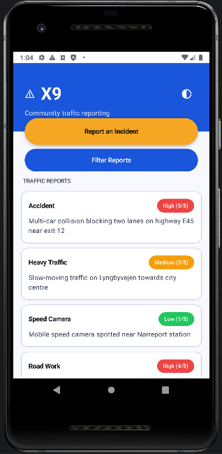
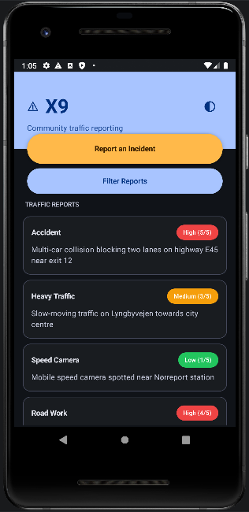
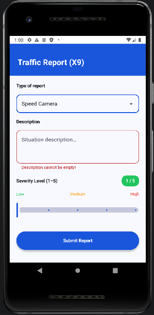
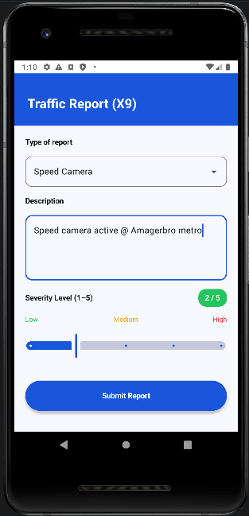
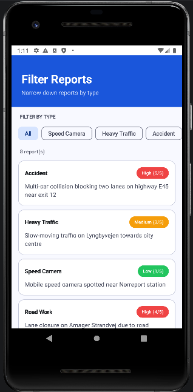

# X9 - Traffic Incident Reporter

## 1. Design Choices

X9 uses a **single-Activity, multi-Fragment architecture**. One `MainActivity` hosts all three screens as Fragments, which simplifies navigation and lifecycle management compared to the multi-Activity approach used in earlier versions (V1–V2). Fragment transactions with named back-stack entries handle forward and backward navigation cleanly.

Data is managed through a **ViewModel with LiveData**. `ReportListViewModel` holds the master report list in memory, scoped to the Activity so it survives fragment swaps and configuration changes such as screen rotation. Each Fragment observes the ViewModel's `LiveData` and updates its UI reactively whenever the list changes.

From V5 onward, all three screens were **migrated to Jetpack Compose**. Compose's declarative approach replaced the earlier XML layouts and RecyclerView adapters while keeping Fragment-based navigation intact. This preserves clear Fragment lifecycle evidence in the codebase while taking advantage of a modern UI toolkit. The git history still contains the RecyclerView + ListAdapter + DiffUtil implementation from V4, demonstrating both patterns.

`TrafficReport` is a **Parcelable data class**, keeping the model lightweight. Reports are passed between Fragments using the **Fragment Result API**, which decouples senders and receivers without shared fields or complex bundles.

## 2. User Interfaces

### Dashboard

The dashboard is the landing screen. A header band displays the app name and a dark-mode toggle button. Below that, two action buttons ("Report an Incident" and "Filter Reports") sit above a scrollable list of submitted reports. Each report card shows the incident type, description, and severity. Users can **swipe a card to delete** it or **tap a card** to view its full details in a dialog.

{height=5cm}

{height=5cm}

### Report Form

The report form lets users submit a new traffic incident. A dropdown selects the report type (e.g. Speed Camera, Accident, Heavy Traffic, Road Work). A text field captures a description, with validation that blocks submission if the field is empty. A severity slider (1–5) is paired with a colour-coded chip that updates in real time. Pressing submit returns the user to the dashboard with the new report visible. If the user presses back with unsaved input, a confirmation dialog asks whether to discard changes.

{height=5cm}

{height=5cm}

### Filter Reports

The filter screen displays a row of filter chips corresponding to each report type. Tapping a chip narrows the list to matching reports. A count indicator shows how many reports match the current filter. As on the dashboard, cards support swipe-to-delete and tap-to-view-details.

{height=5cm}

## 3. Extensions

Beyond the core requirements, the following extensions were implemented:

- **Dark mode toggle** - A toggle button on the dashboard switches between light and dark themes. The preference is saved to `SharedPreferences` and restored on app restart, so the chosen theme persists across sessions.
- **Swipe-to-delete** - Report cards on both the dashboard and filter screens can be swiped away using Compose's `SwipeToDismissBox`, providing an intuitive way to remove reports.
- **Tap-to-view details** - Tapping any report card opens a dialog showing the full report information, giving users quick access to details without navigating away.
- **Form validation with real-time feedback** - The description field shows an error message when the user tries to submit an empty form. The error clears automatically as soon as the user begins typing.
- **Back-press discard guard** - If the report form contains unsaved input, pressing back triggers a confirmation dialog rather than silently discarding the data.
- **Jetpack Compose migration** - All three screens were converted from XML layouts to Compose, replacing RecyclerView with `LazyColumn` and XML views with composable functions.
- **Filter chips** - The filter screen uses Compose filter chips to let users narrow reports by type, with a live count of matching results.

## 4. Testing and Evaluation

Testing was carried out manually on the Android emulator across a range of scenarios:

- **Form validation** -Submitting with an empty description is blocked and shows an error. The error clears when the user starts typing.
- **Navigation flow** -Moving from the dashboard to the report form, submitting a report, and returning to the dashboard correctly displays the new report in the list.
- **Swipe-to-delete** -Swiping a report card removes it from both the dashboard and filter screens. The ViewModel keeps both views in sync.
- **Tap-to-view details** -Tapping a card on either screen opens a details dialog with the correct report information.
- **Dark mode persistence** -Toggling dark mode and restarting the app confirms the theme preference is restored from `SharedPreferences`.
- **Configuration changes** -Rotating the device does not clear the report list or lose scroll position, confirming the ViewModel retains state through configuration changes.
- **Filter chips** -Selecting a filter chip correctly narrows the displayed list, and the count indicator updates to reflect the filtered results.
- **Back-press guard** -The discard dialog appears only when the form contains input; pressing back on an empty form navigates away without interruption.

## 5. Problems Encountered

1. **Fragment back-stack conflicts** -Early versions suffered from duplicate Fragment instances and unexpected back-button behaviour. The issue was traced to inconsistent use of `addToBackStack()`. Adding named back-stack tags to each transaction resolved the duplicates and gave predictable navigation.

2. **Data loss on configuration change** -Rotating the device wiped the report list in versions before V4, because data was held directly in the Fragment. Introducing `ReportListViewModel` scoped to the Activity solved this, as the ViewModel survives configuration changes automatically.

3. **Fragment communication** -Passing data between Fragments was initially handled with bundles and shared fields on the Activity, which created tight coupling. Refactoring to the Fragment Result API gave a cleaner, event-driven approach where `ReportFragment` posts a result and `DashboardFragment` listens for it independently.

4. **RecyclerView not updating** -After adding a new report, the list did not visually update. Calling `notifyDataSetChanged()` worked but was inefficient. Switching to `ListAdapter` with `DiffUtil` provided automatic, animated list updates and eliminated the issue. This was later superseded by Compose's `LazyColumn`, which re-composes on state changes by default.

5. **Compose interop with Fragments** -Embedding `ComposeView` inside Fragments initially caused memory leaks because the Compose composition outlived the Fragment's view. Setting the composition strategy to `ViewCompositionStrategy.DisposeOnViewTreeLifecycleDestroyed` ensured the composition is disposed when the Fragment's view is destroyed, preventing leaks.
