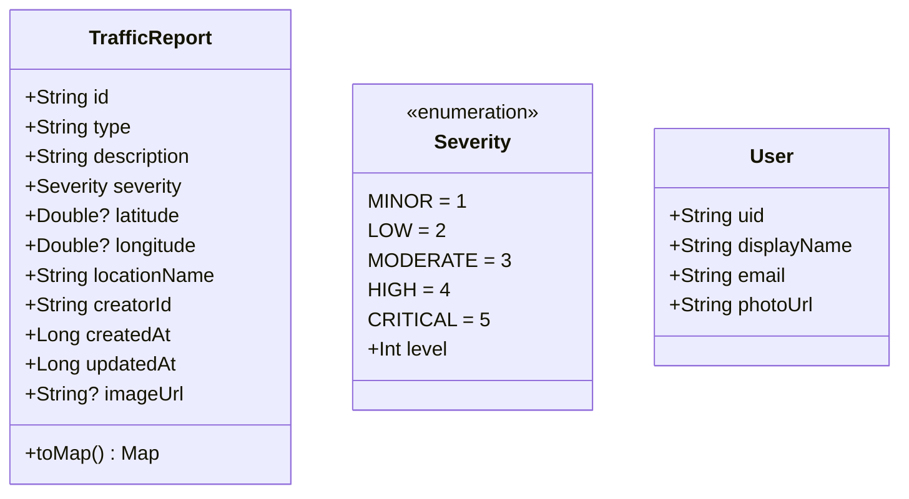
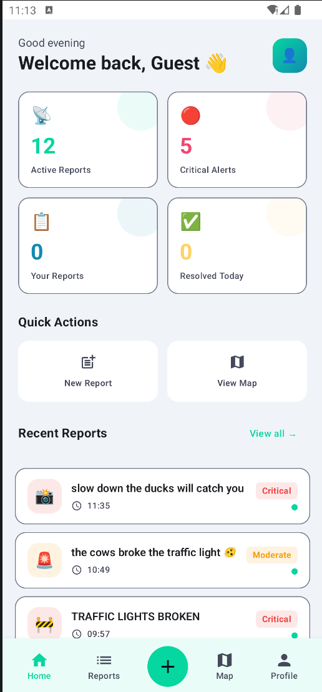
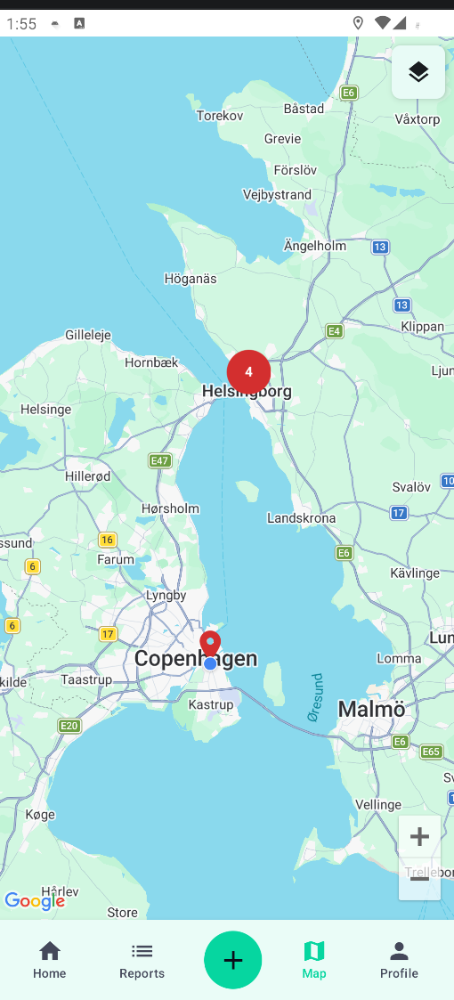
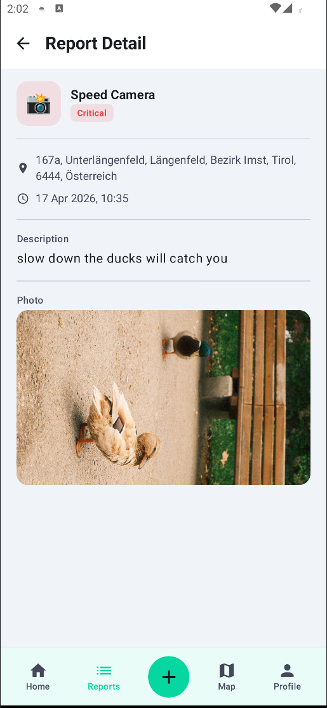
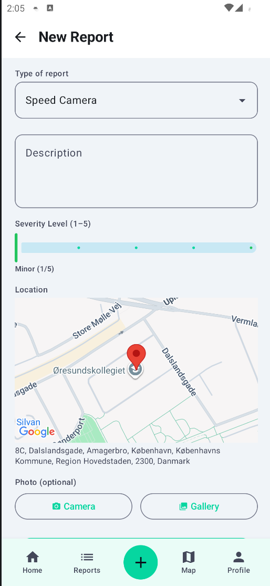
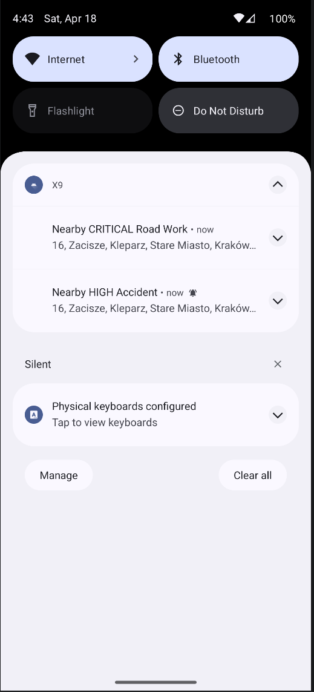
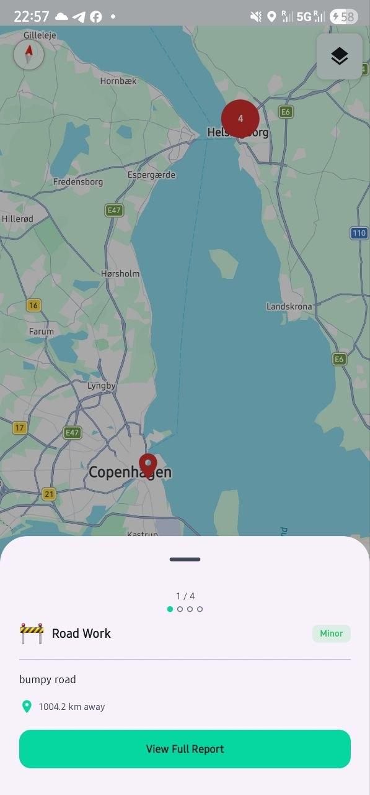
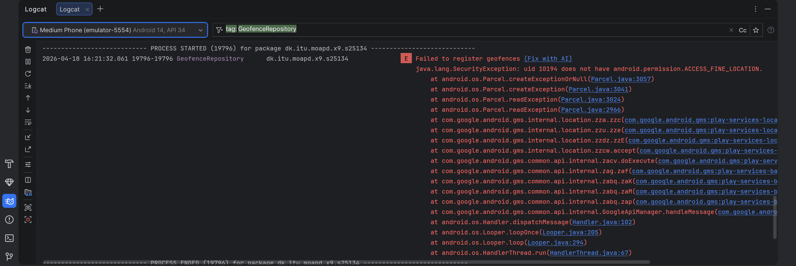

# Group 19 Assignment 2 Report
Members: Loo Zhi Yi, Sean Elisha Koh Tze Li

## Overview - Table of contents:

1. **[Design Choices](#design-choices)**
2. **[User Interfaces](#user-interfaces)**
3. **[Extensions](#extensions)**
4. **[Testing and Evaluation](#testing-and-evaluation)**
5. **[Problems](#problems)**

---

## Design Choices

### Architecture choices

The app follows **MVVM (Model-View-ViewModel)** with the **Repository pattern** that is accessed 
through the different classes through an Application singleton `X9Application`.

Each layer of the application namely, Model, Repository, ViewModel and UI, follows the single-responsibility
principle.

- **Model**: Data classes, `TrafficReport`, `User` and serialization logic with Firebase Realtime database
- **Repository**: Data access to external services such as: Firebase Realtime DB, Firebase Storage,
Firebase Auth, Geofencing, Geocoding etc.
- **ViewModel**: Holds the business logic and the reactive state

### Data classes

The two main data classes in the application are `TrafficReport` and `User`.



---

## User Interfaces

There are 7 main screens designed in X9, namely `DashboardScreen`, `LoginScreen`, `MapScreen`, 
`ProfileScreen`, `ReportDetailScreen`, `ReportFormScreen`, `ReportListScreen`. We can discuss the 
more prominent screens in X9 and briefly the design considerations behind each of these screens.

### `DashboardScreen`

{height=5cm}

- At the top of the dashboard, there was also a `2x2` stat card that provides quick filter options to
reports. E.g., there is the filter for `Active Reports` and `Resolved Today` reports. There is also
filters to filter between your own created reports and critical reports. These quick filter options
allow users to quickly fine reports that are of interest to them.
- There are 2 `Quick Actions cards` namely `New Report` and `View Map` which allows users to quickly
access the report creation workflow and view the maps quickly.
- The `Recent Reports` section provides a list of summarized reports. Users can read recent reports 
at a quick glance. A `View All` button also allows the users to access the list of all reports in 
detail.
- The `Bottom Nav Bar` is always at the bottom of X9. It provides clickable navigation buttons for 
users regardless of where they are at in X9. The buttons are also named in such a way that their 
functionality is self-explanatory to prevent any confusion among users.

### Map Screen

{height=5cm}

- This is the Map screen where all reports are being shown as Red pins (< 4 in a cluster) or a red 
circle labeled with the count of reports in that cluster.
- Adopted a similar UI to an already familiar Google Maps using `Google Maps API` to prevent confusions.

### Report Details screen

{height=5cm)

- This page shows all details of a report to users. This includes fields like location, report type,
severity, description, pictures (if any).
- In this page, there is also authorization guard rails in place such that only the creators of that
report can delete and edit them.

### Report creation screen

{height=5cm]

- This page is where users create new reports. They must fill in the Report type, Description, choose
a severity level and upload images if they want to.
- Geolocation data is prepopulated automatically based on user's current location, it cannot be changed
otherwise.
- User's location is also represented by a small Google Maps composable and reverse Geocoded addresses.
This provides users with both visual and textual ways to check if their current location is correct.

---

## Extensions

1. Geoproximity enabled notifications **_(Assignment 2 extra feature)_**

    - Similar to existing traffic navigation apps (Google Maps, Waze etc.), when users are within 
    the proximity of certain traffic reports, users will receive a notification about them.
    - We will implement Geofences of 500m around all reports with severity `HIGH` or `CRITICAL` and
    will notify users about them with a cooldown of 1 hour tht is stored using `SharedPreferences`. 
    This prevents the users from being spammed with notifications everytime X9 syncs with Firebase.
    - **Rationale**: Alerting users of the reports that concerns then while commuting, allowing them
    to take relevant actions to protect themselves.

    {height=5cm}

    - **Tech stack**: Explored GeoFencing API to create Geofences for each of the reports and used a
    monitoring object to keep track of these Geofences and alert the users when necessary.

2. Speech-enabled report creation **_(Assignment 2 extra feature)_**

    - With a tap of a single button, the user will be able to create a report through speech.
    - **Rationale**: When users are commuting with the app, having to manually provide text input to
    create reports will distract them from the actual road conditions. Having a one-tap work flow to
    create reports allows them to focus on real-life traffic conditions while alerting X9 community
    about road conditions. 
    - TODO: add screenshots of this feature when implemented
    - **Tech stack**: Explored Android SpeechRecognizer library which allows us to parse user's audio
    input into text tokens. These tokens are then processed and triggers their respective workflows 
    in the service layer of the application.
    > _Note: This feature is just a demo-feature and does not have full NLP capabilities and behavior is
    > largely restricted by simple keyword-based routing for code execution._

3. Report clustering on Application's Map screen

    - Each report is represented as a pin on the Maps screen which results in overlapping pins and a
    bad UX for users.
    - **Tech Stack**: Used `maps-compose-utils` library which provides a `clustering` composable.
    Reports are passed as cluster items. The library handles distance-based grouping automatically. 
    We also configured a threshold of 4 reports to trigger clustering into a red bubble count.
    - To allow users to navigate between each of the reports in the cluster, we designed a small 
    scrollable bar with the brief report details at the bottom of the maps. This allows users to 
    navigate between reports and view full details if they wanted to.

   {height=5cm}

    > _Image showing report clustering on the map screen with scrollable report details_

---
   
## Testing and Evaluation

Before each iteration of the application, we will look through the requirements stated in the weekly
exercises and work plans. We will come up with a simple internal document which describes the expected
behavior of the application after this iteration. We understand that the best development practice is
to write unit-tests using `Junit`. But in the interest of time and considering the scale of the project
we decided that conducting smoke tests after each iteration will suffice.

Both physical Android devices and Android studio's built-in Android emulator are being used during
testing. Usually, physical devices are used for convenience and to get a "real feel" of how X9 will 
feel on real phones. The emulator is only used for specific features (geo-proximity enabled notifications)
to spoof the GPS location to test if the notifications are triggered correctly.

The application is also developed in such a way that there is sufficient logging at key code execution
points, which aids our debugging process when faced with problems during the smoke tests. Since there
is no solid testing pipelines in place, we try to limit the blast radius of potential issues by 
adopting trunk-based development. Starting each iteration in their respective branches and only 
merging back to `main` when we are satisfied with the behavior. Given more time, we will want to 
explore incorporating a `JUnit` testing pipeline to ensure the correctness of the code and eliminate
any human errors in the testing process.

> Example of internal document used for smoke tests:
> ```text
> X9-Version-6 requirements:
> 1.) Successful sign-up work flow.
> - Offloaded to firebase auth, just need to test if new users can create account successfully
> - Edge cases: duplicate emails, usernames etc. 
> 2.) Successful log-in, log-out workflow
> - Users should be authenticate and terminate their session gracefully while using the application
> - Check logcat for correct detection of authentication state.
> 3.) Authentication and authorization checks
> - ALL users can read the traffic reports, no matter authenticated or not
> - For update and delete workflows, authorization workflow is such that only creators of the reports 
> themselves can update and delete the reports.
> ```

---

## Problems

1. Problematic place search.

    - Initially when we were implementing Google Maps functionality into X9, we wanted to provide 
    users with the functionality to perform place search, like how they would usually search for 
    places on Google Maps. This allowed users to create reports at locations that they are not 
    physically at. However, the free API that we were using from `Geocoding API` was buggy, and we 
    could not replicate the behavior of Google Maps properly.
    - After much thought, we decided to implement the report creation workflow such that newly 
    created reports will be geolocated automatically with the user's current location. This is inline
    with how Google Maps naviagation does it.

2. Geofence always fails to register on first launch

    - Permission requesting was done at the wrong places previously. `ACCESS_FINE_LOCATION` and 
    `ACCESS_COARSE_LOCATION` was only requested when users first access the Maps page of X9. For first
    time users, when the app is first launched, neither `ACCESS_FINE_LOCATION` nor `ACCESS_COARSE_LOCATION`
    has been granted yet so `ACCESS_BACKGROUND_LOCATION` does not work.
    - Furthermore, there is an inherent race condition that cannot be avoided in the registering of
    Geofences. Geofences is registered once Firebase Realtime database emits the reports and without
    these permissions working correctly, Geofences cannot be registered correctly
   
    {height=5cm}

    - To fix this, we implemented a guard + retry mechanism in `MainActivity.kt` that allows Geofences
    to fail silently when the permissions are not granted correctly. When they are granted by the users,
    the Geofences will then be triggered to be registered again. With this fix, Geofences will be 
    registered properly and new users will be able to get geo-proximity enabled notifications even if
    it is their first time using the app.

3. Lack of severity sorting for report notifications

    - The notifications are correctly showing for reports with severity `HIGH` and `CRITICAL` but
    they are not sorted in any order. `HIGH` severity reports can be shown before `CRITICAL` reports
    in the notification shade.
    - Even though this is purely a UI/UX error, we wanted to ensure the usability of X9. As a user,
    I will be more concerned about `CRITICAL` reports compared to `HIGH` reports.
    - To fix this, we sorted the reports according to severity such that the most severe report is
    shown at the top of the notification shade.
    
    {height=5cm}
